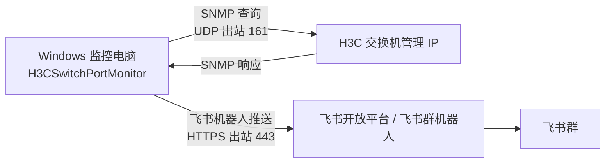
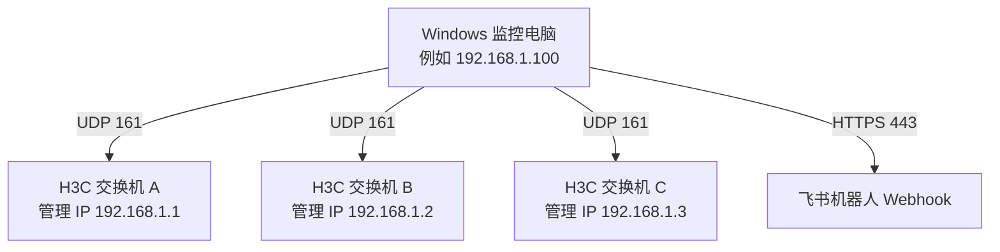

# H3C Switch Port Monitor

Windows 服务程序，用 SNMP 轮询 H3C 交换机端口状态，发现端口 `ifOperStatus` 变化后推送到飞书群机器人。端口备注读取标准 IF-MIB 的 `ifAlias` 字段，对应 H3C 接口下配置的 `description`。

## 网络拓扑

程序只安装在 Windows 监控电脑上。Windows 电脑作为 SNMP Manager，主动访问 H3C 交换机的管理 IP；H3C 交换机作为 SNMP Agent，响应端口状态数据。检测到端口状态变化后，Windows 电脑再通过 HTTPS 调用飞书机器人 Webhook。



多台交换机时，Windows 监控电脑需要能访问每台交换机的管理 IP：



防火墙和 ACL 放行方向：

- Windows 监控电脑 -> H3C 交换机管理 IP：UDP 161
- Windows 监控电脑 -> 飞书 Webhook：TCP 443
- H3C 交换机 SNMP ACL：放行 Windows 监控电脑 IP
- Windows 电脑不需要开放入站 UDP 161，本程序只会自动配置出站 UDP SNMP 规则

## 功能

- 读取端口名：`ifName`，OID `1.3.6.1.2.1.31.1.1.1.1`
- 读取端口描述：`ifDescr`，OID `1.3.6.1.2.1.2.2.1.2`
- 读取管理状态：`ifAdminStatus`，OID `1.3.6.1.2.1.2.2.1.7`
- 读取运行状态：`ifOperStatus`，OID `1.3.6.1.2.1.2.2.1.8`
- 读取端口备注：`ifAlias`，OID `1.3.6.1.2.1.31.1.1.1.18`
- 本地持久化上一轮端口状态，服务重启后仍可发现停机期间发生的状态变化
- 支持飞书机器人签名校验 `Secret`
- 交换机 SNMP 读取失败和恢复时可选推送

## 交换机侧配置

> ⚠️ **安全提醒**：生产环境不要使用 `public` 作为 SNMP community，建议使用随机生成的只读字符串，并通过 ACL 限制只有监控服务器 IP 能访问。

示例仅供参考，实际命令以你的 H3C 设备型号和 Comware 版本为准：

```text
snmp-agent
snmp-agent sys-info version v2c
snmp-agent community read <your-readonly-community>
```

> 注意：同一管理网段内所有交换机的 SNMP 配置相同，监控服务器只需要能访问每台交换机的管理 IP 即可，不需要每台设备单独配置。

接口备注示例：

```text
interface GigabitEthernet1/0/1
 description 上联-防火墙
```

生产环境建议使用独立只读 community，并通过 ACL 限制监控服务器 IP。

## 多交换机配置

同一管理网段内有多台交换机时，只需要在 `appsettings.json` 的 `Switches` 数组中追加多条记录即可。监控服务器只要能通过 SNMP 访问到每台交换机的管理 IP，就能统一管理。

**网络前提：**
- 监控服务器 → 每台交换机管理 IP：UDP 161
- 交换机侧 SNMP ACL 放通监控服务器 IP

**配置示例：按交换机角色区分监控范围**

```json
"Switches": [
  {
    "Name": "核心交换机",
    "Host": "192.168.1.1",
    "Community": "your-readonly-community",
    "IncludeNamePrefixes": [
      "Ten-GigabitEthernet",
      "FortyGigE",
      "HundredGigE",
      "Bridge-Aggregation"
    ]
  },
  {
    "Name": "汇聚交换机-A",
    "Host": "192.168.1.2",
    "Community": "your-readonly-community",
    "IncludeNamePrefixes": [
      "GigabitEthernet",
      "Bridge-Aggregation"
    ],
    "ExcludeInterfaceIndexes": [1, 2]
  },
  {
    "Name": "接入交换机-1",
    "Host": "192.168.1.3",
    "Community": "your-readonly-community",
    "IncludeNamePrefixes": [
      "GigabitEthernet"
    ]
  }
]
```

**按角色区分的意义：**
- 核心/汇聚交换机：监控上联口和聚合口，重点关注 trunk 口状态
- 接入交换机：监控所有千兆口，发现私接交换机或环路

**快速排除故障端口：**

如果某个端口（如上联口）频繁闪断影响判断，可以用 `ExcludeInterfaceIndexes` 排除：

```json
"ExcludeInterfaceIndexes": [1, 2]
```

**只想监控指定端口：**

```json
"IncludeInterfaceIndexes": [5, 10, 15]
```

## 配置

编辑发布目录中的 `appsettings.json`：

```json
{
  "Monitor": {
    "PollIntervalSeconds": 10,
    "PollIntervalMinSeconds": 3,
    "SnmpRetryCount": 2,
    "SnmpRetryDelaySeconds": 3,
    "Firewall": {
      "EnsureSnmpOutboundRule": true,
      "RuleName": "H3CSwitchPortMonitor SNMP Outbound"
    },
    "Feishu": {
      "WebhookUrl": "https://open.feishu.cn/open-apis/bot/v2/hook/替换为你的机器人token",
      "Secret": "如果机器人启用了签名校验则填写"
    },
    "Switches": [
      {
        "Name": "核心交换机-1",
        "Host": "192.168.1.1",
        "Community": "your-readonly-community",
        "Version": "V2C",
        "IncludeNamePrefixes": [
          "GigabitEthernet",
          "Ten-GigabitEthernet",
          "FortyGigE",
          "HundredGigE",
          "Bridge-Aggregation"
        ]
      }
    ]
  }
}
```

如果只想监控指定端口，可以填写 `IncludeInterfaceIndexes`。如果想排除个别端口，填写 `ExcludeInterfaceIndexes`。

程序启动时会在 Windows 上自动检查并创建一条出站 UDP SNMP 防火墙规则，默认规则名是 `H3CSwitchPortMonitor SNMP Outbound`。这个规则只放行本程序访问交换机的出站 UDP 161，不会打开本机入站 UDP 161。

## 日志

日志文件保存在 `logs/app.log`，默认按天滚动，保留 7 天，单文件最大 10MB。超出大小后自动切换新文件，旧文件保留。

> 注意：Windows 服务模式下，程序工作目录是 `C:\H3CSwitchPortMonitor`，所以日志在 `C:\H3CSwitchPortMonitor\logs\`。

修改日志行为（可选）：

```json
"Logging": {
  "File": {
    "Path": "logs/app.log",
    "RollingInterval": "Day",
    "RetainedFileCountLimit": 7,
    "FileSizeLimitBytes": 10485760
  }
}
```

---

## 发布

在装有 .NET 8 SDK 的机器执行：

```powershell
dotnet restore
dotnet publish -c Release -r win-x64 --self-contained true -p:PublishSingleFile=true -o .\publish
```

## 生成一键安装器

Windows 上执行：

```powershell
.\scripts\build-installer.ps1
```

macOS 或 Linux 上交叉构建 Windows 安装器：

```bash
./scripts/build-installer.sh
```

输出文件：

```text
artifacts\installer\H3CSwitchPortMonitorInstaller.exe
```

把这个 exe 复制到 Windows 服务器上，右键选择“以管理员身份运行”。安装器会自动：

- 释放服务程序到 `C:\H3CSwitchPortMonitor`
- 引导填写飞书机器人地址、SNMP community、交换机 IP 和轮询间隔
- 写入 `appsettings.json`
- 注册并启动 `H3CSwitchPortMonitor` Windows 服务

卸载：

```powershell
.\H3CSwitchPortMonitorInstaller.exe --uninstall
```

卸载并删除安装目录：

```powershell
.\H3CSwitchPortMonitorInstaller.exe --uninstall --remove-files
```

## 生成绿色版 zip

Windows 上执行：

```powershell
.\scripts\build-portable.ps1
```

macOS 或 Linux 上交叉构建：

```bash
./scripts/build-portable.sh
```

输出文件：

```text
artifacts\portable\H3CSwitchPortMonitor-portable-win-x64.zip
```

把 zip 复制到 Windows 电脑后直接解压。先双击 `edit-config.cmd` 修改配置，再双击 `run-console.cmd` 前台测试运行。需要后台长期运行时，右键 `install-service.cmd` 选择“以管理员身份运行”。

## 直接闪退排查

不要直接双击 `H3CSwitchPortMonitor.exe` 排查问题，先双击绿色版里的 `run-console.cmd`。这个脚本会在程序退出后暂停窗口。

如果程序启动失败，会把错误写到：

```text
logs\startup-error.log
```

常见原因：

- `appsettings.json` 没有放在 exe 同目录
- 飞书机器人 `WebhookUrl` 还没替换成真实地址
- JSON 格式改坏了
- 交换机 IP、SNMP community 或 SNMP 版本填写错误
- 普通用户权限无法创建 Windows 防火墙规则；可以右键 `run-console.cmd` 或 `install-service.cmd` 选择“以管理员身份运行”

## 手动安装为 Windows 服务

以管理员身份打开 PowerShell：

```powershell
.\scripts\install-service.ps1 -ExePath "C:\H3CSwitchPortMonitor\H3CSwitchPortMonitor.exe"
```

卸载：

```powershell
.\scripts\uninstall-service.ps1
```

查看日志：

```powershell
Get-EventLog -LogName Application -Newest 50 | Where-Object Source -like "*H3C*"
```

## 飞书消息内容

端口状态变化时会发送类似内容：

```text
[端口状态变化]
设备：核心交换机-1 (192.168.1.1)
端口：GigabitEthernet1/0/1 (ifIndex 1)
状态：up -> down
管理状态：up
端口备注：上联-防火墙
时间：2026-04-16 16:30:00 +08:00
```
